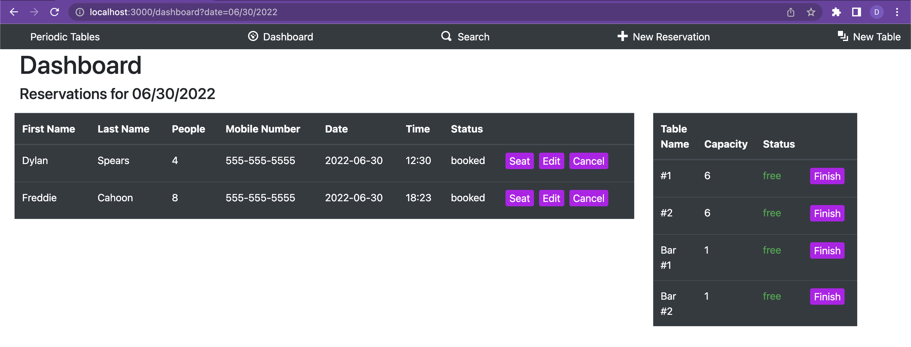

# Restaurant Reservation App

## Link

  A link to your live application

## Summary

    This application allows the user to create and manage restaurant reservations as well as tables. It also allows the user to seat and finish reservations.

## Documentation

  ### Dashboard

    

    The dashboard displays all reservations for the current day as well as a list of all  tables. The list of reservations displays detailed information about the  reservations and allows you to seat, edit, or cancel reservations. Reservations  can be seated at any table with a sufficient capacity. The list of tables on the   dashboard displays whether the table is seated and allows the user to finish the  reservation and unseat the table.

    The dashboard can also be used to view reservations for a different date by adding a query to the end. For example:
      
      /dashboard?2022-06-01

  ### New Reservation

    The new reservation page displays a form allowing the user to create a new reservation. The form as well as the API validates the user input and prevents the user from creating reservations for invalid dates and times.

  ### New Table

    The new table page allows the user to create a new table by naming it and setting the seating capacity.

  ### Search

    The search page allows the user to search for reservations by mobile number. It displays all reservations matching that number regardless of date or status. The search page also allows the user to cancel or edit reservations listed.

## Technologies

  ### React.js
    
   <tab> - Used to create the user interface for the application.

  ### Express

    - The back end application was built using express.js to handle requests and responses.

  ### PostgreSQL

    - The language for CRUD operations with the database.

  ### Knex

    - This application uses Knex.js to manage the tables in the database as well as to query the tables from the server.

  ### Bootstrap

    - Bootstrap is used in this application for most of the styling of the user interface.

## Installation instructions

  - Fork and clone this repository.
  - Run `cp ./back-end/.env.sample ./back-end/.env`.
  - Update the `./back-end/.env` file with the connection URL's to your ElephantSQL database instance.
  - Run `cp ./front-end/.env.sample ./front-end/.env`.
  - You should not need to make changes to the `./front-end/.env` file unless you want to connect to a backend at a location other than `http://localhost:5000`.
  - Run `npm install` to install project dependencies.
  - Run `npm run start:dev` to start your server in development mode.
